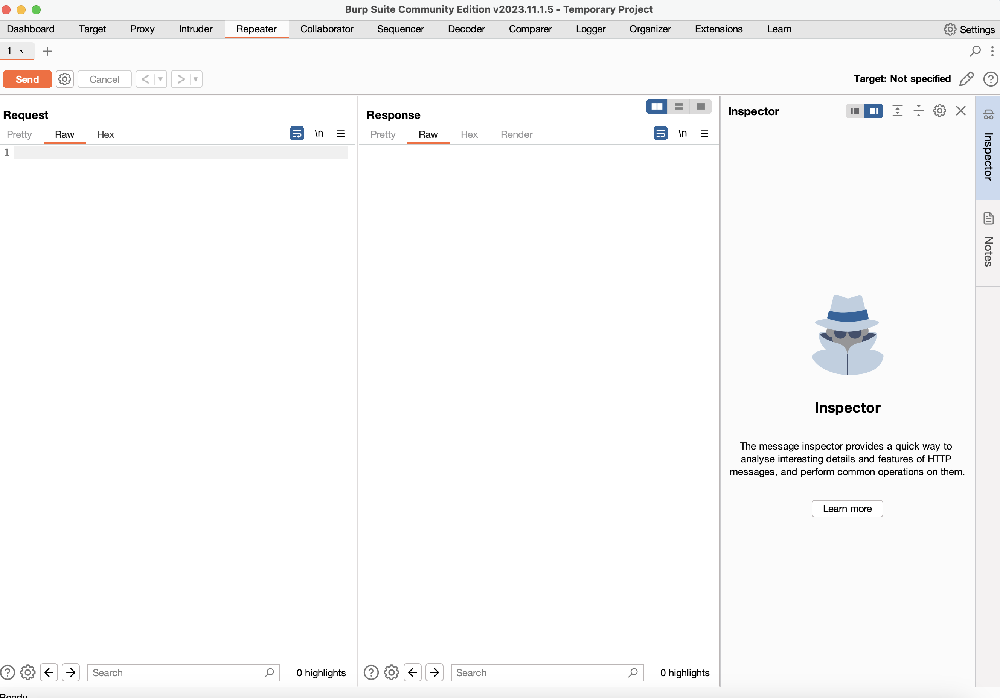

# Insecure direct object reference (IDOR)

### Prostredie: Juice-Shop - https://github.com/juice-shop/juice-shop#from-sources

- IDOR je zraniteľnosť spočívajúca v tom, keď neúmyselne sprostredkujeme prístup ku objektu, ktorý by osoba bez dostačujúcich práv nemala vidieť alebo keď je prístup k objektom zlé navrhnutý.
- Ideálnym príkadom pre IDOR je prípad zobrazený v systéme juiceshop. Pri zobrazení položky “network” vo vývojárskej konzole môžeme vidieť rôzne požiadavky. Pri vyfiltrovaní XHttp requestov môžeme vidieť požiadavky, ktoré sa priamo dopytujú na server o dáta.
- Detailnou analýzou pri prehliadaní odpovedí od servera môžeme nájsť rôzne dáta, vrátane dáta prichádzajúce z endpointu /api/users
- Endpoint vracia podľa identifikačného čísla údaje o používateľovi z databázy. Zrovna takáto konštrukcia býva najčastejším miestom kde dá vyskytuje IDOR.
- Použitím BurpSuite nástroja (inštalácia - https://portswigger.net/burp/releases/professional-community-2024-2-1-5?requestededition=community&requestedplatform=) si vieme spustiť interceptor (viď. príloha), ktorý odchytí každú požiadavku a sprístupní nám detail požiadavky s možnosťou úpravy.

- Po spustení interceptora a odchytení spomínanéj požiadavky si celé telo požiadavky skopírujeme a presunieme do repetera (viď. príloha). Repeater umožňuje opakovane odosielanie požiadavok na server, čím ich vieme posielať aj modifikovať.

- Odoslaním požiadavky s pôvodným id môžeme vidieť, že sa nám vrátili našime údajme. 
- Takýmto spôsobom môžeme skúšať rôzne id a získavať informácie o zaregistrovaných používateľoch a to napríklad ich email, deluxeTokeny a rôzne časové dáta o aktivite používateľa. 

- Video návod sa nachádza v priečinku "video_instructions": /video_instructions/idor.mp4 (https://github.com/MatusVetrik/dp-attacks-instructions/blob/main/video_instructions/idor.mp4)
