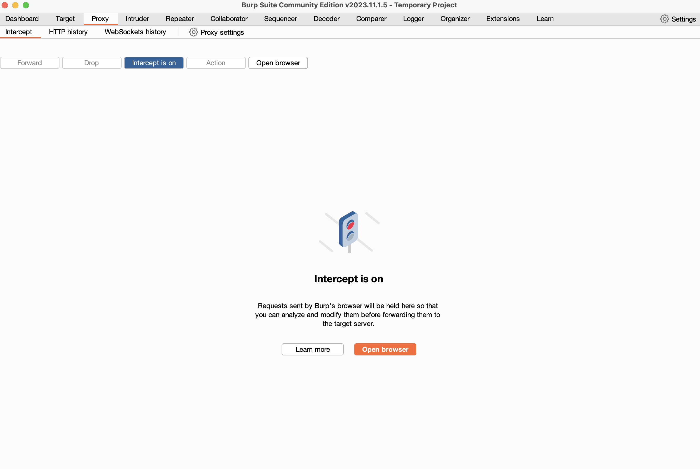

# Insecure direct object reference (IDOR)

### Prostredie: Juice-Shop - https://github.com/juice-shop/juice-shop#from-sources

- IDOR je zraniteľnosť spočívajúca v tom, keď neúmyselne sprostredkujeme prístup ku objektu, ktorý by osoba bez dostačujúcich práv nemala vidieť alebo keď je prístup k objektom zlé navrhnutý
- Ideálnym príkadom pre IDOR je prípad zobrazený v systéme juiceshop. Pri zobrazení vývojárskej konzoly a tabu “network” môžeme vidieť rôzne requesty. Väčšina z nich sú obyčajne doťahovanie kaskádnych štýlov, ikon a skriptov ale pri vyfiltrovaní XHttp requestov môžeme vidieť tie, ktoré prijamo dopytujú server o dáta.
- Detailnou analýzou pri prehliadaní odpovedí od servera môžeme nájsť zaujímavé dáta ale nič čo by sme vidieť nemohli. Až na jeden endpoint a tým je /api/users
- Táto API vracia podľa identifikačného čísla údaje o používateľovi z databázy. Zrovna takáto konštrukcia býva najčastejším miestom kde dá vyskuytuje IDOR.
- Použitím BurpSuite nástroja (inštalácia - https://portswigger.net/burp/releases/professional-community-2024-2-1-5?requestededition=community&requestedplatform=) si vieme spustiť interceptor (viď. príloha), ktorý odchytí každý request a sprístupní nám detail requestu ako aj jeho úpravu.

- Po spustení interceptora a odchytení spomínaného requestu si celé telo re skopírujeme a presunieme do repetera (viď. príloha). Repeater umožňuje opakovane odosielanie requestu na server, čím vieme posielať requesty a zároveň ju aj upravovať.

- Skúsime odoslať request s pôvodným id a môžeme vidieť, že sa nám vrátili dáta s našimi údajmi. 
- Takýmto spôsobom môžeme skúšať rôzne id a získavať informácie o zaregistrovaných používateľoch a to napr. ich email, deluxeTokeny a rôzne časové dáta o aktivite užívateľa. 

- Video návod sa nachádza v priečinku "video_instructions": /video_instructions/idor.mp4 (https://github.com/MatusVetrik/dp-attacks-instructions/blob/main/video_instructions/idor.mp4)
